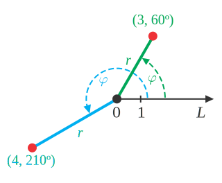

# Book---Fundamentals-of-Data-Visualization

### Types of variables 
|  Type  |  Scale  |  Example  |
| ------ | ------- |  -------- |
| Quanittative / numerical continous    | Continous       | Height of students in a class |
| Quantitave / numerical discrete       | Discrete        | Number of students in a class |
| Qualitative / categorically unordered | Discrete        | Cat, Dog, Fish                |
| Qualitative / categorically ordered   | Discrete        | good, fair, poor              |
| Date or Time                          | Discrete or Cont| 25 Jan, 20 dec 2021           | 
| Text                                  | None or discrete| 'My name is Hardik'           |

    

### Different types of coordinate systems 
- Cartesian Coordinates 

  - The traditional x and y coordinate system. 
  - If X and Y are measured in same units, then they must have same spacing between ticks. 
  
   
  
- Non linear axis

  - We transform the value of a given axis, using functions like log, square root. 
  - This is useful to suite the graph according to the story, or when the range of the values of quite large. 
  - Also used to display the values which uses mulitplication or division in them. 
   
  
  
- Coordinate System with cureved axis

   
